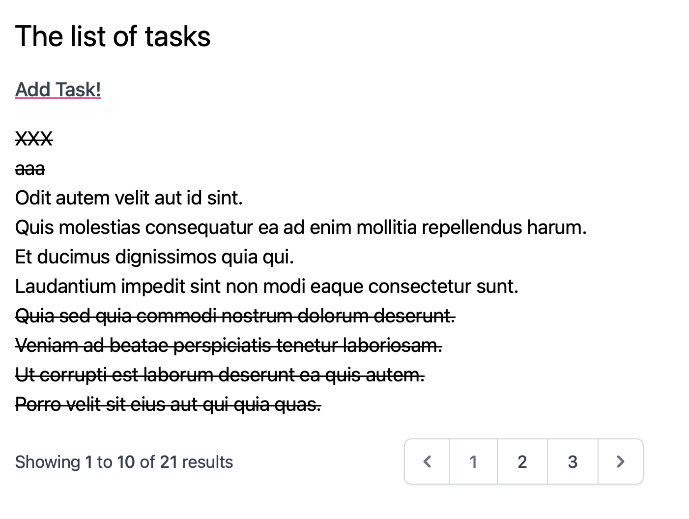
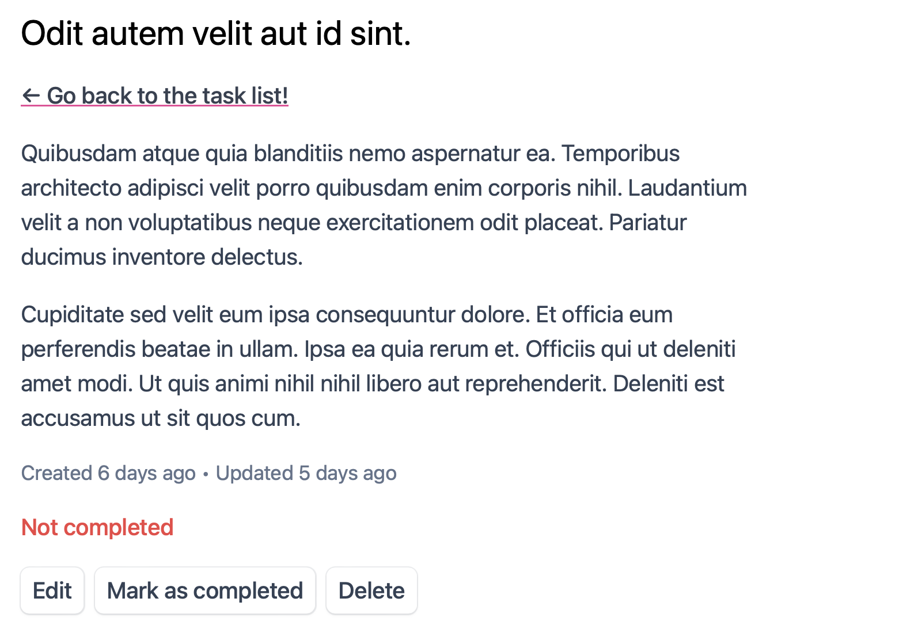
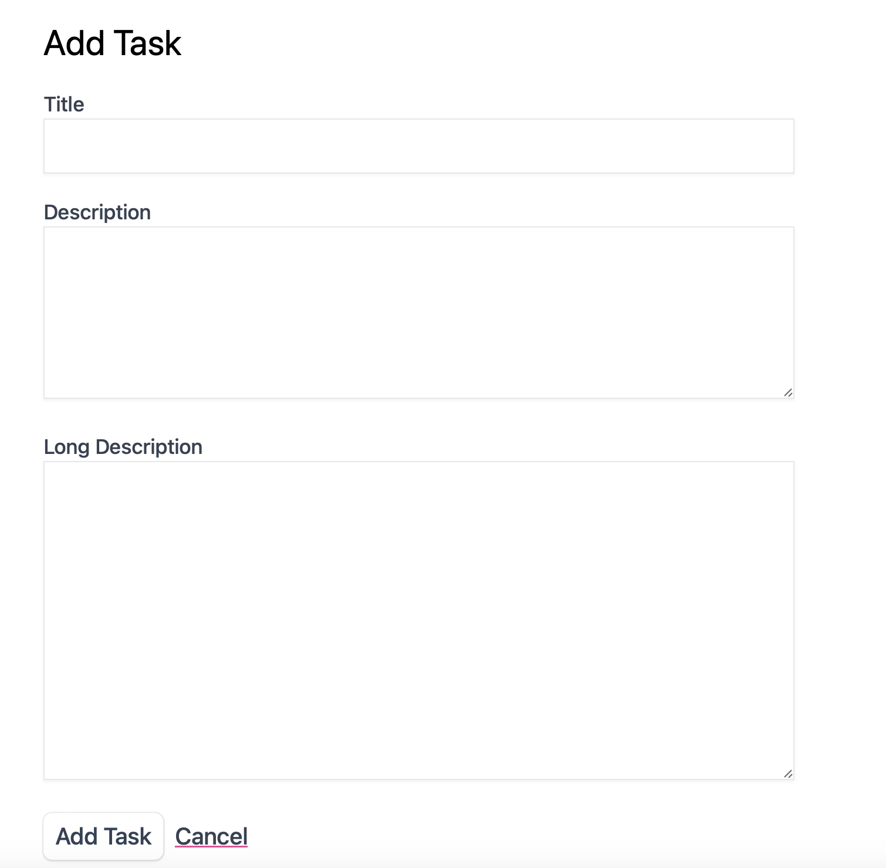
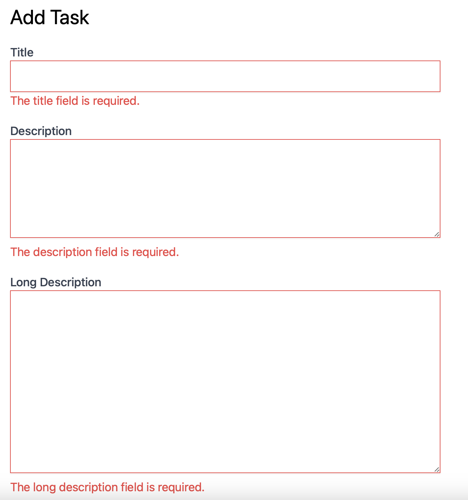

## Learning Laravel

This is learning project for me to see how laravel app where structured.

It is a simple task list with blade, tailwind, flash-messages, forms with error handling and csrf, pagination

